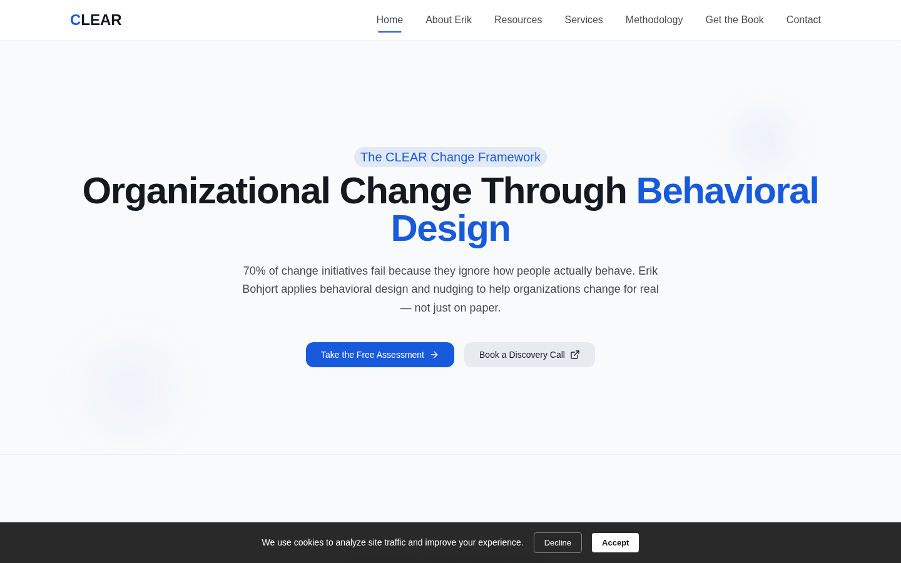
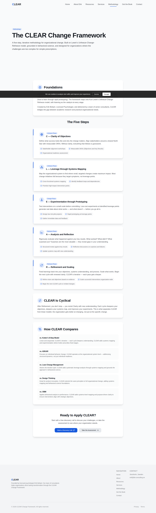
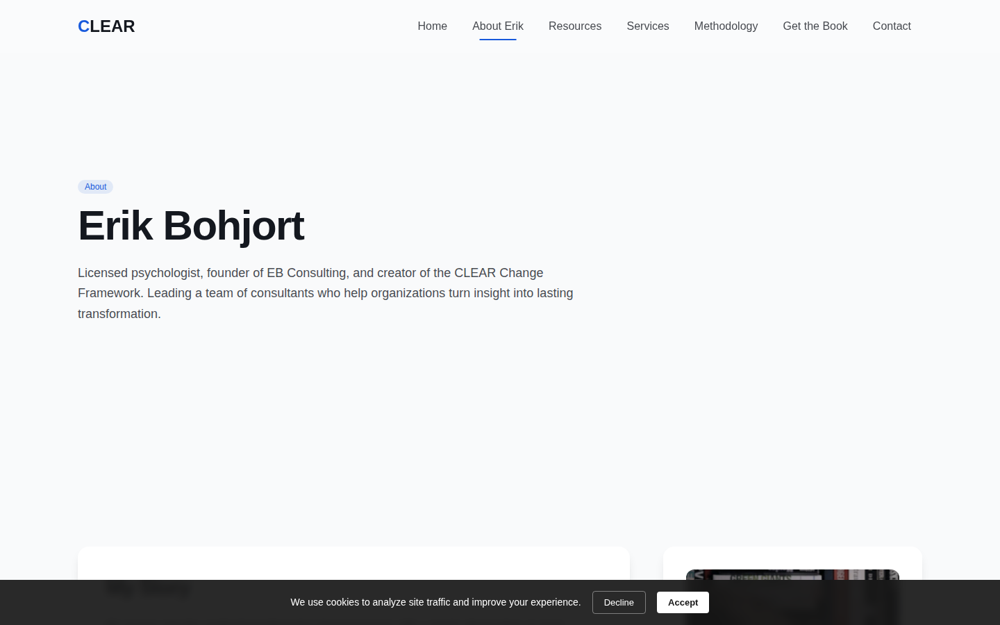
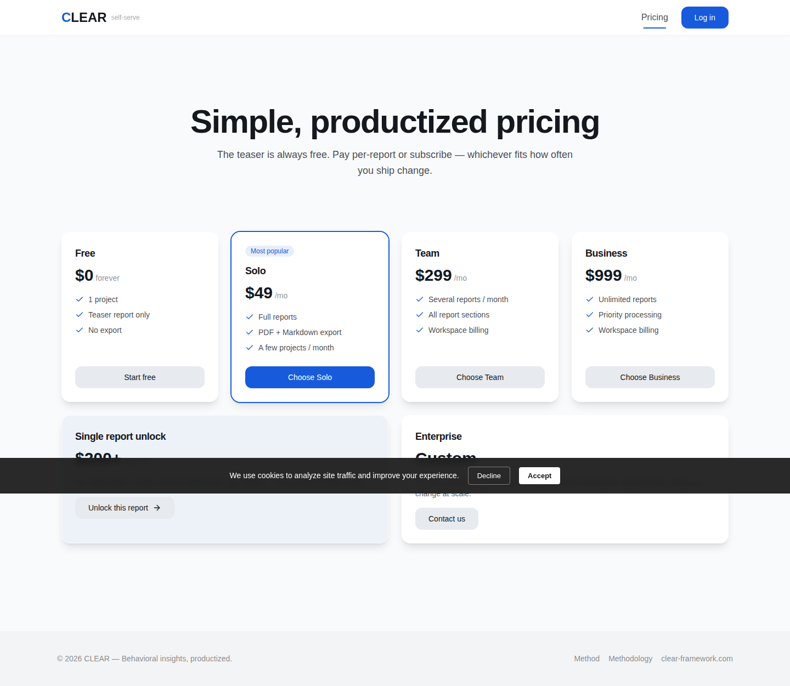
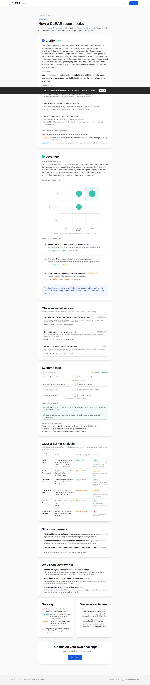
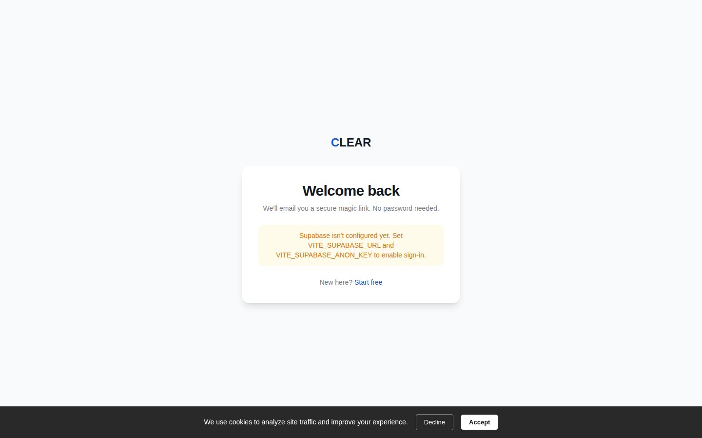
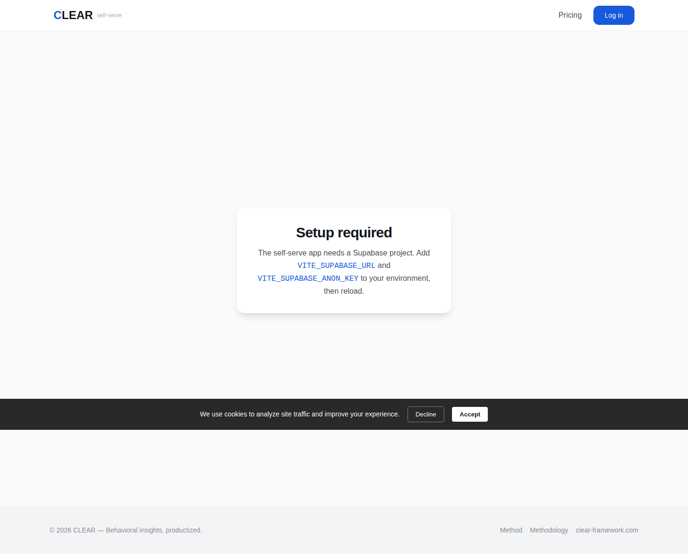
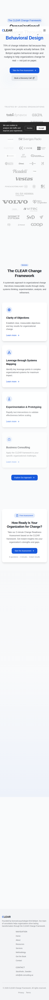

# UI design audit — listen-transform-lead

**Date:** 2026-06-24 · **Method:** visual (headless Chrome, desktop 1440 + mobile 390) + source review ·
**Coverage:** all 45 routes + 96 components (48 domain + 48 shadcn/ui) · **Findings:** 433 (132 high · 197 medium · 104 low)

This is an **audit only** — no application code was changed. It was produced by running the
[`taste-skill`](../../.claude/skills) design skills against every screen: `redesign-existing-projects`
for the audit checklist, the `design-taste-frontend` pre-flight gates for the marketing/landing pages, and
app-upgrade standards for the product UI (the flagship taste-skill explicitly excludes dashboards/data-tables,
so `/app/*` was held to product-UI standards, not landing-page standards).

## Report index

| File | What's in it |
|---|---|
| **[design-system.md](./design-system.md)** | Global/foundation findings (`index.css`, `tailwind.config.ts`, `Layout.tsx`). **Start here** — these lift every page. |
| **[pages.md](./pages.md)** | Per-route findings for all ~45 routes. |
| **[components.md](./components.md)** | The 48 domain components + shadcn primitives, in 7 clusters. |
| **[coverage.md](./coverage.md)** | Every route/component and whether it got visual+code or code-only, with reasons. |
| **[screenshots/](./screenshots)** | Curated illustrative captures. (Full 135-shot set was generated for the audit but kept out of the repo.) |

---

## Verdict

The app is **functionally complete and not broken-looking** — there's a single locked blue accent on the
marketing pages, real specific copy (no Lorem Ipsum), thorough SEO/structured data, GPU-safe motion, and a
real print stylesheet. But it reads as a **lightly-themed shadcn/Vite starter**, and the classic "generic AI
build" tells are present at every level. The good news: a large share of the 132 high-severity findings
collapse into **~7 global fixes** that lift the whole app at once.

### The 7 highest-leverage fixes (do these first)

1. **Fix the display font.** `tailwind.config.ts:68-71` sets the display family to **SF Pro Display**, which
   only resolves on Apple hardware and silently falls back to **Inter var** everywhere else — so headings
   render identical to body text. Only Inter is actually `@import`ed (`index.css:194`). Load a real display
   face (Geist / Outfit / Cabinet Grotesk / Satoshi) and headings gain presence across all 45 pages.
   _(redesign-skill: "Inter everywhere" — the #1 AI tell.)_
2. **Collapse the 5-colour CLEAR phase palette.** `index.css:47-53` defines five accent hues
   (`--phase-c/l/e/a/r`) that render as five chip/border colours (most visible on `/methodology`), breaking
   the one-accent lock. Keep ONE locked accent; express phases as tints/labels, not five saturated hues.
3. **Add `:active` + `:focus-visible` to buttons.** `.btn-primary` / `.btn-secondary` / `.nav-link`
   (`index.css:81-111`) have hover but **no pressed state and no visible focus ring** (only `.input` has one).
   Fixing this at the `.btn`/`ui/button.tsx` level resolves ~30 high-severity interaction/a11y findings at once.
4. **Global em-dash sweep.** Em-dashes in UI copy are the single most frequent high-severity finding
   (13 instances), starting in the hero subtitle (`Hero.tsx:33`). Replace with periods/commas per the copy gate.
5. **WCAG-AA contrast pass on buttons & forms.** ~11 high findings: light placeholders on near-white inputs,
   low-contrast helper/label text, ghost buttons over photos with no scrim. Audit every CTA and form control to 4.5:1.
6. **Decide dark mode.** `darkMode: ['class']` + `dark:` variants are wired, but there is **no `.dark{}` token
   block** in `index.css`, so dark mode is dead code. Either add the token block or strip the `dark:` variants.
7. **Fix the broken hero gradient (real bug).** `Hero.tsx:120-121` pipes an HSL token into `rgba(var(--primary…))`,
   which is invalid CSS — the intended ambient glow never paints, leaving the hero a flat centered text wall.

### Not just aesthetics — these are bugs

- **Broken hero background gradient** (`Hero.tsx:120-121`) — renders transparent.
- **Dead dark mode** — no `.dark{}` block, so the wired `dark:` variants never apply.
- **Content hidden until JS runs** — Hero/About (and others) set `opacity:0` inline and reveal via a JS
  `setTimeout`; if JS fails or is slow, the page renders **blank**. (`Hero.tsx:130-157`, `About.tsx:15-26`.)
- **SF Pro Display never loads** for non-Apple visitors — silent font fallback.

---

## Findings at a glance

**By severity:** 🔴 132 high · 🟠 197 medium · 🟡 104 low (433 total)

**By dimension:**

| Dimension | Total | High |
|---|--:|--:|
| Interactivity & States | 80 | 30 |
| Content (copy/voice) | 67 | 26 |
| Component Patterns | 65 | 11 |
| Accessibility | 47 | 27 |
| Layout | 41 | 12 |
| Typography | 36 | 4 |
| Color & Surfaces | 35 | 14 |
| Code Quality | 24 | 1 |
| Iconography | 19 | 0 |
| Strategic Omissions | 19 | 7 |

**Worst-offending surfaces** (by high-severity count): `resources`, `foundation`, `about`, `product`,
`lp/*`, `comp-site-chrome`, `comp-product-dataviz`, `comp-product-tabs`, `services/*`, `app` dashboard.

---

## Remediation roadmap

Ordered by the redesign-skill **Fix Priority** (max visual impact, min risk). Each tier is a sensible PR.

| # | Tier | What | Representative files |
|--:|---|---|---|
| 1 | **Font** | Load a real display face; stop falling back to Inter for headings | `tailwind.config.ts:68-71`, `index.css:194` |
| 2 | **Colour & surfaces** | One locked accent (collapse phase palette); fix hero-gradient bug; real `glass`/tinted shadows; a radius scale | `index.css:47-53,73-79`, `Hero.tsx:120-121` |
| 3 | **Interaction states** | `:active` + `:focus-visible` on all buttons/links/cards | `index.css:81-111`, `src/components/ui/button.tsx` |
| 4 | **Copy sweep** _(quick)_ | Remove em-dashes; unify narrator voice; kill AI clichés ("in the world of…"); one CTA intent per page | `Hero.tsx:33`, `About.tsx:68/88/107`, `CTASection.tsx` |
| 5 | **Layout & spacing** | Fix half-empty heroes; replace equal-card feature rows with asymmetric layouts; de-stack identical `glass-card`s | `Index.tsx`, `About.tsx`, section components |
| 6 | **Replace generic components** | Testimonial carousel, 3-tower pricing emphasis, footer link-farm, accordion FAQ, generic cards | `TestimonialsSection.tsx`, `Pricing.tsx`, `Layout.tsx`, `FAQ.tsx` |
| 7 | **Loading / empty / error states** | Skeletons (not spinners), composed empty states, inline form errors (no `window.alert`/"Oops!") | product `*Tab.tsx`, forms, `Dashboard.tsx` |
| 8 | **Type & a11y polish** | Type scale, tabular-nums for data tables, contrast tidy-ups, alt text, semantic landmarks | `index.css`, `comp-product-dataviz` |

> Tiers 1–4 are mostly **global, low-risk edits** to `index.css` / `tailwind.config.ts` / a handful of shared
> components, and they neutralise the majority of high-severity findings. Tiers 5–8 are per-surface craft work.

---

## Visual reference

A few captures that illustrate the recurring issues (full annotated set per page in [pages.md](./pages.md)):

| | |
|---|---|
|  **Home hero** — flat, fully-centered text wall; the intended ambient gradient is broken (`Hero.tsx:120`) so there's no visual anchor. |  **Methodology** — the five-colour CLEAR phase palette breaks the one-accent lock. |
|  **About hero** — half-empty composition with a large right-side void and a tall dead gap before content. |  **Pricing** — generic three-tower table; recommended tier not emphasised by colour/weight. |
|  **Sample report** — product data-viz; check tabular-nums, table density, and non-colour-only coding. |  **Login** — audit input/placeholder/label contrast and focus rings. |
|  **/app (coverage caveat)** — renders the auth/config fallback without a session; the real dashboard was audited from source. |  **Home (mobile)** — responsive check at 390px. |

## Methodology & limitations

- **Visual capture:** every public route was rendered in headless Chrome (puppeteer) at 1440px and 390px and
  cross-referenced against source. `/app/*`, `/respond/:token`, and `/auth/callback` require an authenticated
  session or a valid token, so their screenshots show the auth/empty fallback — those screens were audited
  **from source** for their real UI. See [coverage.md](./coverage.md).
- **Template families:** the 6 service-detail, 7 consulting/niche, and 7 landing pages were audited as
  families (every screenshot reviewed; findings reported per-family with page-specific call-outs) because they
  share `LandingPage.tsx` / `NichePage.tsx` templates.
- **Audit only:** no source files were modified. Findings cite concrete `file:line` evidence; spot-check before
  acting. A few line numbers may drift as the code evolves.
- **Scope:** this measures design quality against the taste-skill / redesign-skill anti-slop standards. It is
  not a functional QA, performance, or security review.
